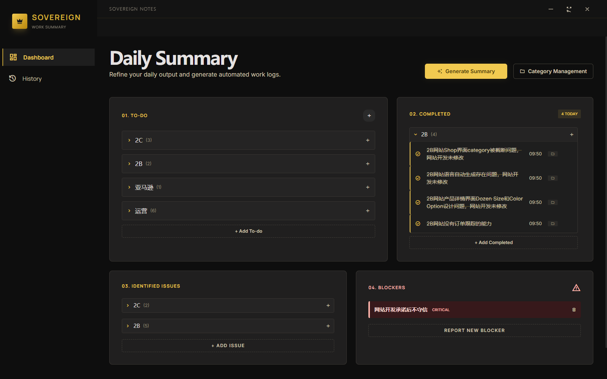
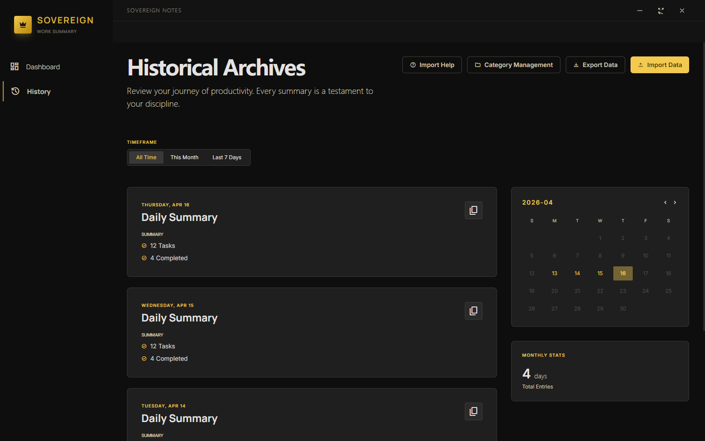

# Sovereign Notes

A modern desktop application for tracking daily work summaries.





## Features

| Feature | Description |
|---------|-------------|
| **Four Categories** | To-do, Completed, Identified Issues, Blockers |
| **Priority System** | High (H), Medium (M), Low (L) for todos |
| **Severity Levels** | High, Mid, Low for issues |
| **Category Management** | Organize items into custom categories with collapsible cards |
| **Due Date Picker** | Set deadlines for your todos |
| **Drag & Drop** | Reorder items within categories |
| **History View** | Browse and review past daily summaries |
| **Import/Export** | Backup and restore data in JSON format (includes categories) |
| **Auto Carry-forward** | Previous day's incomplete items carry over automatically |

## Interface Guide

### Left Sidebar
- **SOVEREIGN** logo with crown icon
- **Dashboard** - Main view for daily tasks
- **History** - View past daily summaries
- **Category Management** - Create and manage custom categories

### Main Area
- **Daily Summary** - Current date header with title and subtitle
- **Date Picker** - Navigate to different dates
- **Calendar** - Visual date selection
- **Action Buttons** - Import Help, Category Management, Export Data, Import Data

### Four Task Boxes

1. **01. TO-DO** - Tasks to be completed
2. **02. COMPLETED** - Finished tasks
3. **03. IDENTIFIED ISSUES** - Problems you've discovered
4. **04. BLOCKERS** - Issues you cannot resolve

### Item Actions
- **Checkbox** - Mark as complete (To-do) or move back to source (Completed)
- **Priority/Severity** - Click badge to cycle through levels (H/M/L or High/Mid/Low)
- **Due Date** - Click clock icon to set deadline
- **Category** - Click folder icon to assign category
- **Delete** - Remove item

## Getting Started

### Installation

1. Download from [Releases](https://github.com/jiataoxiang1998/Sovereign-Notes/releases)
2. Run `Sovereign Notes Setup 1.0.0.exe`
3. Launch the application

### Daily Workflow

1. **Start your day** - App automatically carries over incomplete items from yesterday
2. **Add tasks** - Click the **+** button in any section to add new items
3. **Set priorities** - Click the priority badge to change levels
4. **Mark complete** - Click checkbox to move items to Completed
5. **Review** - At end of day, review and summarize your work
6. **Export** - Export data for backup

### Categories

1. Click **Category Management** button
2. Enter category name and click **Add**
3. Click the **folder icon** on any item to assign it to a category
4. Items are grouped by category in collapsible cards

### Import/Export

- **Export** - Click "Export Data" to download all data as JSON
- **Import** - Click "Import Data" and select a JSON file
- Note: Imported data merges with existing data (same dates overwrite)

## Tech Stack

- **Frontend**: Vue 3 + Vite + TypeScript
- **Styling**: Tailwind CSS
- **Desktop**: Electron
- **Build**: electron-builder

## Development

```bash
# Install dependencies
npm install

# Run in development mode
npm run dev

# Build for Windows
npm run build

# Build for macOS (requires macOS)
npm run build:mac
```

## Data Location

On Windows, data is stored in:
- `%APPDATA%/Sovereign Notes/`

## License

MIT

---

Made with ❤️